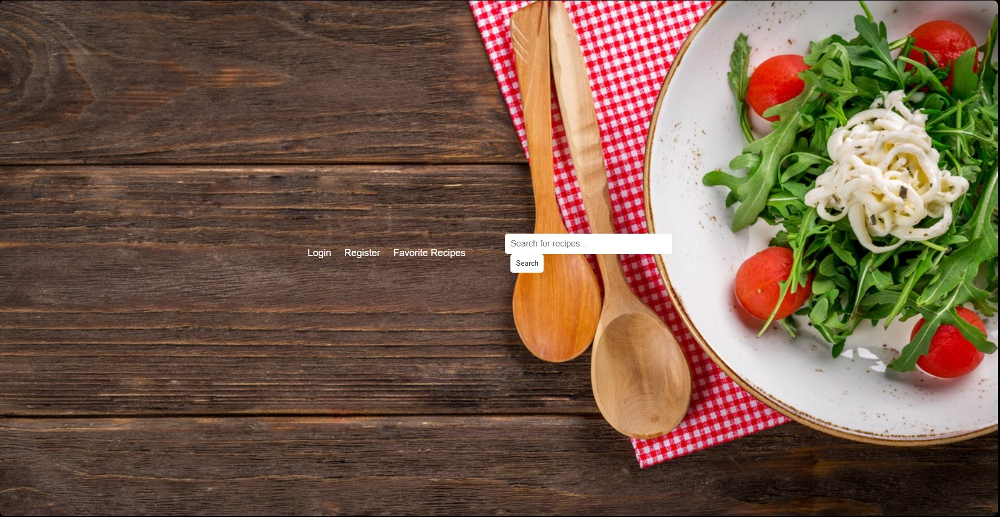
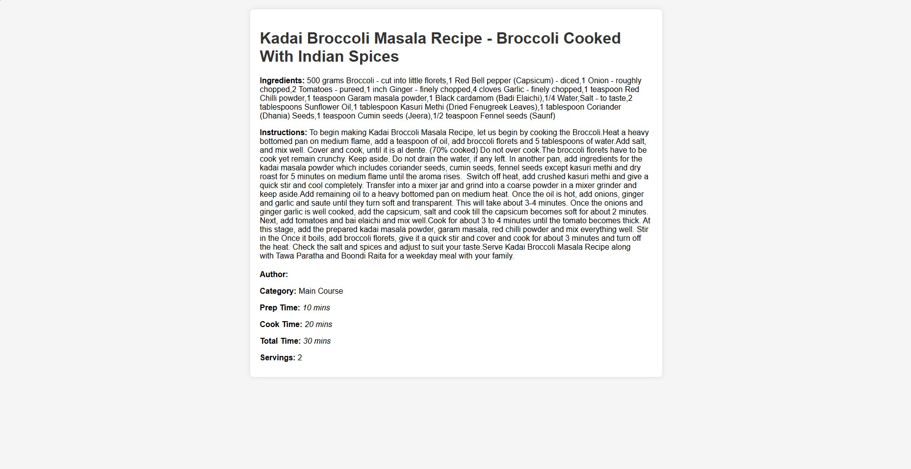
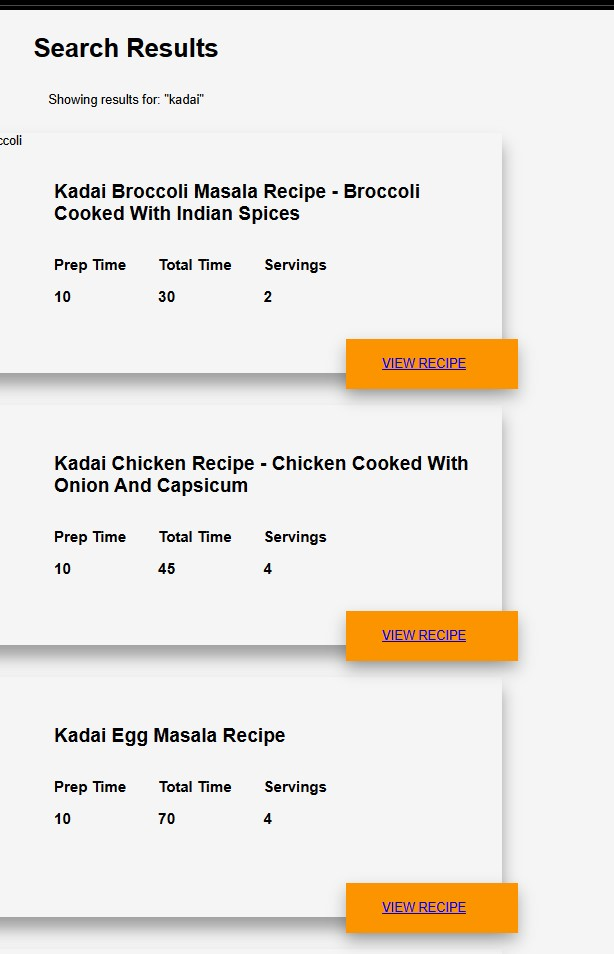

# 🍽️ Recipe Sharing Platform

A web application that allows users to share and discover recipes. Built with Flask for the frontend and SQL for the database.

## ✨ Features

-   🔐 **User Authentication**: Secure user login and registration.
-   📜 **Recipe Management**: Users can create, view, edit, and delete their recipes.
-   🔍 **Recipe Discovery**: Browse and search for recipes shared by other users.
-   📱 **Responsive Design**: Accessible on both desktop and mobile devices.

## 🛠️ Technologies Used

-   🎨 **Frontend**: Flask
-   🖥️ **Backend**: Python
-   🗄️ **Database**: SQL
-   🏗️ **HTML/CSS**: For structuring and styling the web pages

## Screenshots




## 🚀 Installation

1.  **Clone the Repository**:
    
    ```bash
    git clone https://github.com/CodeInfinity007/Recipie-Sharing-Platform.git
    cd Recipie-Sharing-Platform
    
    ```
    
2.  **Set Up a Virtual Environment**:
    
    ```bash
    python3 -m venv venv
    source venv/bin/activate  # On Windows, use venv\Scripts\activate
    
    ```
    
3.  **Install Dependencies**:
    
    ```bash
    pip install flask
    
    ```
    
4.  **Configure the Database**:
    
    -   Ensure you have a SQL database set up via dat.py
    -   Update the database configuration in the application as needed.
    
5.  **Run the Application**:
    
6.  **Access the Application**:
    
    -   Navigate to 🌐 `http://localhost:5000` in your web browser.

## 🎯 Usage

-   📝 **Register**: Create a new account to start sharing your recipes.
-   🔑 **Log In**: Access your account to manage your recipes.
-   🍲 **Add a Recipe**: Share your favorite recipes with the community.
-   🔎 **Browse Recipes**: Discover new recipes shared by other users.
-   ✏️ **Edit/Delete Recipes**: Manage your submitted recipes.

